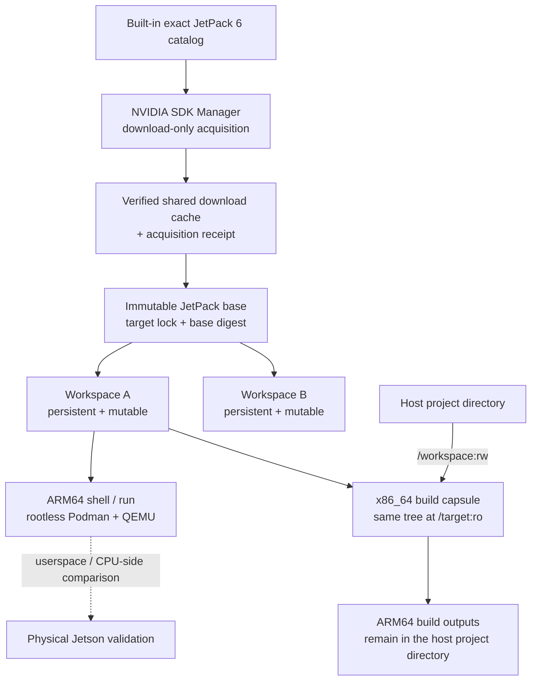

# Orin Stage (`ostg`)

[](https://github.com/fatihaybsn/Orin-Stage/actions/workflows/ci.yml)
[](https://github.com/fatihaybsn/Orin-Stage/actions/workflows/orin-stage-reference.yml)

**Orin Stage** is a local development workspace engine for **NVIDIA Jetson Orin + JetPack 6**.

On an x86_64 Ubuntu machine, it can build an exact JetPack / Jetson Linux ARM64 userspace from official NVIDIA inputs, keep that environment as a persistent workspace, run ARM64 userspace through QEMU, and cross-build against the very same target tree.

The point is not to replace the Jetson. It is to move more target-side work earlier, before you have to copy everything to a board just to discover an architecture, package, loader, filesystem, or ABI problem.

> **Orin Stage is a userspace development tool, not a Jetson hardware emulator.** GPU, DLA, camera, Jetson kernel, firmware, bootloader, device-tree, power, thermal, and real performance behavior still require a physical Jetson.

---

## Why Orin Stage?

Developing for Jetson from an x86_64 workstation can hide differences until deployment:

- ARM64 vs. x86_64 architecture and ABI behavior
- exact JetPack/L4T package and filesystem state
- Python wheels and native-library compatibility
- target-specific headers, libraries, loaders, and build assumptions

A normal Ubuntu container is useful, but it does not automatically reproduce a JetPack target userspace. A generic ARM64 machine is closer in CPU architecture, but it still does not give you the exact JetPack/L4T software state.

Orin Stage builds that target context from official NVIDIA inputs and keeps project-specific changes in separate persistent workspaces.

### Why I built it

I started Orin Stage as a portfolio and learning project around a simple question:

> **How much Jetson-side development can I move to my x86_64 machine without pretending that the Jetson hardware is there?**

That question gave me a real reason to work through Linux user namespaces, ARM64 userspace execution, cross-compilation, filesystem ownership, immutable and mutable state, caching, atomic publication, locking, failure handling, Debian packaging, and physical-device validation as one connected system.

The project was not meant to become a general container platform or a Jetson emulator. I kept narrowing it to one problem I could actually validate: build an exact JetPack 6 software environment, keep it around, use it for development, and make the hardware boundary explicit.

---

## Where it helps

Orin Stage is most useful **before** the part of development that genuinely needs Jetson hardware.

A physical board is still the final reference, but not every iteration needs GPU, camera, Jetson kernel behavior, or real performance. Package work, dependency debugging, filesystem changes, CPU-only ARM64 execution, target-side inspection, and cross-builds can often happen earlier on the workstation.

That matters in a few practical situations:

- **Trying another JetPack version without destroying the old environment.** Switching a physical Jetson between releases can mean reflashing or rebuilding device state. Orin Stage keeps exact releases side by side, so a JP6.1 workspace can stay untouched while you prepare JP6.2.3.
- **Keeping several environments for the same release.** One verified JP6.2.3 base can back `project-a`, `project-b`, and `experiment` workspaces. A package or configuration change in one does not modify the others.
- **Using a shared, remote, or rented Jetson more efficiently.** If board access is limited or billed by time, software-side iteration can stay local and the real device can be reserved for GPU, DLA, camera, kernel/device, timing, power, thermal, and performance work.
- **Experimenting without constantly rebuilding the target from zero.** Once the NVIDIA inputs and exact base are already verified, they can be reused instead of being downloaded and constructed again for every workspace.
- **Working when the board is simply not available.** You can still inspect the target package state, test ARM64 CPU-side behavior, resolve dependencies, and prepare builds before the next hardware session.

Orin Stage does **not** make Jetson flashing itself faster, and it does not remove the need for hardware validation. The time saving comes from not using the board for work that does not require the board in the first place.

A useful way to position the project is:

| Environment | Best question to ask |
|---|---|
| **Generic ARM64 CI / cloud** | “Does this compile and run on normal Linux ARM64?” |
| **Orin Stage** | “How does this behave inside this exact JetPack 6 / Jetson Linux target software environment?” |
| **Physical Jetson** | “How does it behave with the real GPU, camera, kernel/device stack, timing, power, thermals, and hardware performance?” |

The goal is not **“you do not need a Jetson.”** It is closer to:

> **Use the Jetson when the work actually needs a Jetson.**

---

## What you can do with it

| Capability | What it means in practice |
|---|---|
| **Choose an exact JetPack 6 target** | Work with JetPack 6.0, 6.1, 6.2, 6.2.1, 6.2.2, or 6.2.3 as separate target environments. |
| **Keep persistent workspaces** | Install packages, change files and configuration, close the shell, and come back to the same state later. |
| **Keep versions side by side** | Prepare a new JetPack release without converting or deleting an older workspace. |
| **Create multiple workspaces from one base** | Reuse one verified exact base for independent projects or experiments on the same JetPack release. |
| **Run ARM64 userspace on x86_64** | Open an ARM64 shell or run a single target command through rootless Podman + QEMU. |
| **Cross-build for Jetson** | Build on the x86_64 host while using the same JetPack workspace as a read-only target sysroot. |
| **Reuse expensive state** | Verified NVIDIA downloads and immutable bases are reused instead of being recreated for every workspace. |
| **Inspect exact identity** | See the target, base, workspace ID, generation, and build-toolchain identity behind an environment. |
| **Manage lifecycle and disk usage** | Create, reset, remove, inspect, measure, and explicitly clean managed state without a background garbage collector. |

A single immutable base can back several independent workspaces. Changes made in one workspace do not modify the base or another workspace.

---

## Supported hosts and installation

The primary host platform is **x86_64 Ubuntu**.

| Host | Project validation |
|---|---|
| Ubuntu 22.04 LTS, native x86_64 | validated |
| Ubuntu 24.04 LTS, native x86_64 | validated |
| Ubuntu 22.04 / 24.04 under WSL2 | tested; see the recorded host-acceptance scope |

The detailed host-acceptance notes are kept in [`release/acceptance/0.1.0-host-acceptance.md`](release/acceptance/0.1.0-host-acceptance.md).

### Install from the public PPA

```bash
sudo add-apt-repository ppa:fathaybasn/orin-stage
sudo apt update
sudo apt install orin-stage
```

This is a project-maintained Launchpad PPA, not a package from the official Ubuntu archive.

Then check the host:

```bash
ostg --version
ostg doctor
```

The Debian package installs the `ostg` command and the runtime dependencies Orin Stage owns. You do **not** need to clone this repository or maintain a project virtual environment for normal use.

### NVIDIA SDK Manager

The PPA does **not** bundle or redistribute the NVIDIA JetPack/BSP/RootFS inputs used to build a target. Those inputs are acquired on your machine through NVIDIA's own SDK Manager and its normal login/licensing flow.

Install SDK Manager from NVIDIA when you need to acquire a target for the first time:

<https://developer.nvidia.com/sdk-manager>

SDK Manager is not required for every Orin Stage command. If a valid base and workspace already exist, you can keep using them even when SDK Manager is unavailable. This is why `ostg doctor` can report SDK Manager as a warning while treating core execution requirements as failures.

> **Run `ostg` as your normal user, not with `sudo`.** Your account needs sudo access because Orin Stage elevates only the small host operations that actually require it. If an `ostg shell` shows `root`, that is root inside the rootless Podman user namespace, not host root access.

---

## Quick start

### 1. Check the host and choose a target

```bash
ostg doctor
ostg target list
```

`ostg target list` reads the catalog packaged with Orin Stage. It does not contact NVIDIA, run SDK Manager, or create a data root just to show the supported targets.

### 2. Acquire and prepare the exact JetPack base

```bash
ostg target ensure jetson-orin@jp6.2.3
```

For a fresh target, Orin Stage verifies the exact catalog entry, uses SDK Manager in a download-only acquisition flow, verifies the downloaded artifacts, and constructs the immutable base. `target ensure` does not flash a Jetson.

If the verified acquisition or exact base already exists, it is reused. A file is not considered a valid cache hit just because its filename matches; the recorded identity and hashes must still match.

Orin Stage's SDK Manager role is deliberately target-focused. It does not try to turn the host Ubuntu installation into a full JetPack development machine by selecting the broad host-side CUDA/VPI/NvSci stack, Developer Tools, DeepStream, or Holoscan as part of normal target acquisition.

A reused local cache can avoid repeated NVIDIA downloads, but a fresh target construction is not advertised as universally offline: Ubuntu package dependencies can still require repository access.

### 3. Create a persistent workspace

```bash
ostg workspace create \
  --target jetson-orin@jp6.2.3 \
  --name demo
```

The workspace is independent mutable state created from the exact immutable base. You can have, for example, a JP6.1 workspace and a JP6.2.3 workspace on the same computer without one changing the other.

A workspace stays bound to the JetPack/base identity it was created from. There is no in-place `upgrade`, `rebase`, or version switch. To try a different JetPack release, create another workspace.

### 4. Work inside the ARM64 userspace

Open an interactive target shell:

```bash
ostg shell --workspace demo
```

Or run one command directly:

```bash
ostg run --workspace demo -- /bin/uname -m
```

Target command exit codes are propagated back to the caller. The Podman process is temporary; the workspace is not. Closing a shell or removing the transient container does not delete your workspace state.

### 5. Cross-build from your project directory

```bash
cd ~/src/my-project
ostg build --workspace demo -- <your-build-command>
```

One detail matters here: the directory where you run `ostg build` is mounted into the build capsule as **`/workspace:rw`**. That is where your source tree and normal build outputs live.

The JetPack workspace is mounted separately as **`/target:ro`** and used as the target sysroot. The build can see changes you intentionally made in the workspace, but it cannot write back into that target tree.

### 6. Inspect what you are actually using

```bash
ostg inspect --workspace demo
ostg storage status
```

`inspect` is not only a pretty metadata view: it checks the workspace's target/base identity chain before presenting it as valid state.

---

## Architecture

A useful way to think about Orin Stage is that **Orin Stage owns the state; Podman only executes against it**.



The important split is simple:

- **Base:** verified, immutable, and reusable for one exact target identity.
- **Workspace:** mutable user state. APT, pip, files, and configuration changes live here.
- **ARM64 executor:** opens that workspace as the target rootfs and executes CPU-only ARM64 userspace through QEMU/binfmt.
- **Build capsule:** runs the cross-compiler natively on x86_64 and sees the same workspace read-only at `/target`.
- **Podman:** owns only the temporary process/container lifetime. It does not own the workspace lifecycle.

This avoids maintaining one environment for shell testing and a second, slowly drifting sysroot for builds.

### Exact identity instead of “close enough”

A workspace is not identified only by the label `JetPack 6.2.3`. Orin Stage keeps an identity chain around the state it creates:

```text
JetPack selector
      ↓
exact target lock + verified NVIDIA inputs
      ↓
immutable base digest
      ↓
workspace ID + generation
      ↓
build toolchain identity
```

That identity is why an existing base can be reused safely, why a corrupted cache entry is not silently trusted, and why a workspace is not automatically moved from one JetPack release to another.

---

## Physical Jetson validation

<p align="center">
  
</p>

<p align="center">
  <strong>Recorded validation:</strong> Orin Stage ↔ physical Jetson Orin NX
</p>

A **JetPack 6.2.1 / Jetson Linux 36.4.4** workspace was compared with a physical **Jetson Orin NX 16 GB** reference device.

<p align="center">
  
</p>

<p align="center">
  <em>Physical reference device used for the JP6.2.1 validation.</em>
</p>

The validation record checks the parts Orin Stage is designed to represent locally:

| Check | Result |
|---|---|
| Target identity | JetPack 6.2.1 / L4T 36.4.4 / ARM64 matched |
| NVIDIA package identity | `nvidia-jetpack` and `nvidia-l4t-core` versions matched |
| `nvidia-l4t-core` payloads | **51 / 51** package-owned payload files matched byte-for-byte |
| ARM64 artifact | the exact same binary was used on Orin Stage and the physical Jetson |
| Runtime behavior | Orin Stage output matched the physical Jetson |
| Negative control | native x86_64 produced the expected different architecture-sensitive result |
| Evidence integrity | frozen SHA-256 manifests verify the recorded files |

A small architecture-sensitive demo makes the difference visible:

```text
x86_64 host              Orin Stage / ARM64        Physical Orin NX
-----------              ------------------        ----------------
plain char: signed       plain char: unsigned      plain char: unsigned
value:      -1           value:      255           value:      255
                                └──────── MATCH ────────┘
```

This demo is not a claim of whole-device equivalence. The physical record combines it with exact JP6.2.1 package identity and package-owned payload verification.

**[View the full JP6.2.1 physical validation record →](validation/physical/jp6.2.1-orin-nx/)**

---

## JetPack 6 target catalog

| Selector | JetPack | Jetson Linux / L4T | Support | Published physical record |
|---|---:|---:|---|---|
| `jetson-orin@jp6.0` | 6.0 | 36.3 | supported | — |
| `jetson-orin@jp6.1` | 6.1 | 36.4 | supported | — |
| `jetson-orin@jp6.2` | 6.2 | 36.4.3 | supported | — |
| `jetson-orin@jp6.2.1` | **6.2.1** | **36.4.4** | **supported** | **Jetson Orin NX 16 GB** |
| `jetson-orin@jp6.2.2` | 6.2.2 | 36.5.0 | supported | — |
| `jetson-orin@jp6.2.3` | 6.2.3 | 36.5.2 | supported | — |

All current GA JetPack 6 catalog targets have completed the project's physical validation gate and are reported as `supported` by the current catalog. The JP6.2.1 record above is the published detailed physical validation record showing the project's validation method and evidence model. Use `ostg target list` to see the support state reported by the build you have installed.

Future targets can also carry `validation-pending` or `unavailable` state. A validation-pending target requires the explicit `--allow-validation-pending` opt-in; it is not silently treated as supported.

---

## CLI reference

The CLI is intentionally small. The table below is the user-facing command surface in the current source tree.

| Command | What it does | Persistent-state effect |
|---|---|---|
| `ostg --version` | Print the installed Orin Stage version. | none |
| `ostg doctor` | Check host prerequisites and report readiness without fixing or reconfiguring the host. | none |
| `ostg target list` | Show the built-in exact JetPack 6 catalog. It does not contact NVIDIA just to list targets. | none |
| `ostg target ensure <selector>` | Verify/acquire the exact NVIDIA inputs when needed, then reuse or construct the immutable base for that target. | may create acquisition data and a base |
| `ostg workspace list` | List published workspaces with their IDs, JetPack versions, and generations. | none |
| `ostg workspace create --target <selector> --name <name>` | Create a persistent mutable workspace from an already ensured exact target/base. | creates a workspace |
| `ostg workspace reset <workspace>` | Show a reset plan, then restore the workspace to its **same exact base** when confirmed with the workspace ID. | discards workspace mutations and advances generation |
| `ostg workspace remove <workspace>` | Show a removal plan, then delete only that workspace when confirmed with its exact workspace ID. | deletes the workspace only |
| `ostg shell --workspace <workspace>` | Open an interactive ARM64 target shell. | successful mutable sessions advance workspace generation |
| `ostg run --workspace <workspace> -- <command>` | Run one ARM64 target command and propagate the target program's exit status. | successful mutable runs advance generation |
| `ostg build --workspace <workspace> -- <command>` | Run a host-native x86_64 cross-build. The target workspace is `/target:ro`; the current host directory is `/workspace:rw`. | workspace stays read-only; build outputs stay in the host project directory; the managed toolchain may be acquired if missing |
| `ostg inspect --workspace <workspace>` | Verify and display target, base, workspace, generation, execution, and toolchain identity. | none |
| `ostg storage status` | Show tracked SDK Manager cache, base, workspace, and build-output usage. | none |
| `ostg storage delete base <target-digest>` | Show a base-deletion plan and delete only after exact digest confirmation. A referenced base is blocked. | may delete an unused base |
| `ostg storage delete sdkm-cache` | Show the SDK Manager download-cache deletion plan and clear it only after explicit confirmation. | removes download bytes; keeps acquisition receipts/response records |

The global option `--data-root PATH` selects a different Orin Stage state root for the command. This can be useful when you want an experimental set of targets/workspaces completely separate from your normal state.

For commands that can destroy state, the first call without the required confirmation token is a plan/dry-run. Orin Stage deliberately asks you to confirm the **identity of the object**, not just answer a generic `yes` prompt.

For example:

```bash
# First call: show the plan
ostg workspace reset demo
ostg workspace remove demo
ostg storage delete base <target-digest>
ostg storage delete sdkm-cache

# Second call: execute only with the exact identity/token shown in the plan
ostg workspace reset demo --confirm <workspace-id>
ostg workspace remove demo --confirm <workspace-id>
ostg storage delete base <target-digest> --confirm <target-digest>
ostg storage delete sdkm-cache --confirm sdkm-downloads
```

---

## Managed data and persistence

The default data root is:

```text
~/.local/share/orin-stage
```

A simplified view of the current layout is:

```text
~/.local/share/orin-stage/
├── sdkm/
│   ├── downloads/                 # reusable NVIDIA download bytes
│   ├── responses/                 # SDK Manager response records
│   └── receipts/                  # acquisition identity/evidence
├── targets/<target-lock-digest>/
│   ├── base/                      # immutable target filesystem
│   ├── lock.json
│   ├── manifest.json
│   ├── receipt.json
│   └── materialization/           # workspace materialization seed
├── workspaces/<workspace-id>/
│   ├── root/                      # persistent mutable target tree
│   └── workspace.json
├── state/                         # lifecycle receipts and locks
├── staging/                       # unpublished lifecycle work
└── build/
    └── toolchains/                # managed pinned cross-toolchains
```

You can select a completely separate state area with the global option:

```bash
ostg --data-root /path/to/other-state <command> ...
```

This is useful when you want an experimental Orin Stage state completely separate from your normal one.

> **Do not manage the data root with `rm -rf`, manual renames, bulk `chown`/`chmod`, or file-manager moves.** The directories are visible on the host, but their UID/GID mapping, locks, receipts, generations, and identity relationships are managed by Orin Stage. Use the CLI lifecycle/storage commands instead.

Because workspaces use rootless user-namespace UID/GID mapping, some ownership values can also look unusual when inspected directly from the host. That is expected and is another reason not to “fix” ownership by hand.

---

## Workspace and storage behavior

These rules are worth knowing before you start keeping long-lived environments:

| Action | What happens | What does **not** happen |
|---|---|---|
| Close `ostg shell` | the transient executor exits | the workspace is not deleted |
| `ostg workspace reset demo` | `demo` is rebuilt from its **same exact base**; workspace mutations are discarded | it does not upgrade or switch JetPack versions |
| `ostg workspace remove demo` | that workspace is removed | its base and SDK Manager download cache are not removed |
| `ostg storage delete sdkm-cache` | downloaded SDK Manager bytes are cleared after explicit confirmation | existing bases/workspaces are not deleted; acquisition receipts/responses are kept |
| `ostg storage delete base <digest>` | an unused base can be removed after an identity-confirmed plan | a base still referenced by any workspace is not allowed to be removed |

### What happens if I delete the SDK Manager cache?

An already-created base or workspace does not need the original BSP/RootFS download copies to keep running. Clearing `sdkm/downloads` therefore does not break those environments.

There is an important distinction, though: if you later run `ostg target ensure` again and the verified acquisition bytes are no longer present, Orin Stage may need to download them again. “My workspace still works” and “this target will never be downloaded again” are not the same thing.

### Can I delete a base that has workspaces?

Not through Orin Stage. Base deletion is blocked when even one workspace still references that target/base. If workspace metadata is unreadable or inconsistent, deletion fails closed instead of guessing that the base is unused.

Manually deleting a base underneath a workspace is unsupported. The workspace directory may still physically exist, but Orin Stage can no longer prove the identity relationship it expects, so lifecycle/inspection operations can fail.

### Does Orin Stage clean old data automatically?

No. There is no age-based cleanup, background cleaner, or automatic garbage collector. `ostg storage status` shows tracked storage and deletion is an explicit user decision.

The current **Tracked total** covers the SDK Manager download cache, bases, workspaces, and managed build-output area. The managed cross-toolchain is stored separately and is not currently included in that total.

---

## Lifecycle and safety model

Orin Stage keeps the implementation fairly conservative because the environments are long-lived and can be large.

### Workspaces are published atomically

Create/reset/remove operations do not expose a half-prepared tree as a valid workspace. New state is prepared in staging first and only published after validation. Lifecycle receipts record enough information for tested recovery/reconciliation logic to distinguish what was actually published if a process is interrupted.

Disk-full and SIGKILL-style failure paths are part of the workspace lifecycle test coverage.

### Conflicting operations are locked

The same workspace is not allowed to be reset while another mutable operation is simultaneously changing it. Workspace and lifecycle operations are coordinated with Linux file locks instead of relying on a long-running daemon.

### Generation is a revision marker, not a filesystem hash

A workspace starts at generation `0`.

- a successful mutable shell/run session advances the generation;
- a failed target command does not commit a new generation;
- a successful reset advances it;
- a build leaves it unchanged because the target workspace is mounted read-only.

The generation tells you which Orin Stage workspace revision you are using. It is not a claim that every filesystem byte was hashed after every command.

### Acquisition fails closed

The shared SDK Manager folder is a byte cache, not the source of truth. Reuse depends on the receipt and expected artifact identity/hashes. A same-named file with changed bytes is not silently accepted as the previous target input.

### Authentication output is kept out of the Orin Stage receipt

SDK Manager's interactive login/progress stream can contain user-facing authentication material. Orin Stage intentionally does not copy that stream into its acquisition receipt. The receipt stores the target/acquisition identity and verification evidence instead.

---

## Scope

| Represented locally | Requires physical Jetson |
|---|---|
| JetPack / L4T userspace package state | GPU execution |
| ARM64 CPU-only userspace via QEMU | DLA |
| filesystem and dynamic-linker behavior | camera / sensor pipelines |
| APT / pip / non-hardware dependency work | Jetson kernel, device nodes, ioctls |
| cross-build against the target workspace | bootloader / firmware / device tree |
| target-side CPU behavior within the tested corpus | performance / thermal / power behavior |

The physical validation record is therefore evidence for the **userspace and CPU-side scope tested there**, not for the hardware-specific items in the right column.

Orin Stage also intentionally does **not** provide an in-place JetPack upgrade/rebase workflow. If you want to compare two releases, keep two exact workspaces instead of mutating one environment into another release.

---

## How the project is validated

The project uses several layers because they answer different questions.

### 1. Normal CI

Every push to `main` and pull request to `main` runs the automated test suite on two GitHub-hosted x86_64 environments:

- Ubuntu 22.04 + Python 3.10
- Ubuntu 24.04 + Python 3.12

The current source tree contains **614 collected tests** covering the catalog/resolver, acquisition receipts, base construction policy, materialization, workspace lifecycle, CLI behavior, storage guards, build capsule, Debian packaging, and failure paths.

### 2. Native ARM64 reference

The manually triggered **Orin Stage ARM64 Reference** workflow runs the same deterministic userspace probe in two places:

```text
Orin Stage workspace                    GitHub native ARM64 runner
x86_64 → Podman → QEMU → ARM64          native ARM64 CPU
                 \                      /
                  └──── normalized diff ────┘
```

This is a generic ARM64 CPU/userspace reference, not Jetson hardware validation.

### 3. Physical Jetson validation

The physical validation layer adds a matching JetPack reference device and checks target/package/payload/runtime evidence for the scope Orin Stage represents locally. The published JP6.2.1 record includes the terminal replay, exact hashes, package/payload comparison, negative control, and frozen evidence manifests.

None of these layers is presented as GPU or whole-device emulation.

---

## A few engineering choices behind the project

These are the decisions that shape most of the code:

- **Official inputs first.** Target environments are constructed from NVIDIA's official JetPack/Jetson Linux inputs instead of treating an arbitrary Ubuntu ARM64 image as equivalent.
- **Immutable base, mutable workspace.** A verified base is shared; project-specific changes live in independent workspaces.
- **State belongs to Orin Stage.** Podman is an executor, not the storage/lifecycle database for the target environment.
- **One tree for shell and build.** ARM64 execution and x86_64 cross-build both refer to the same workspace rather than maintaining a second sysroot copy.
- **Least privilege.** Everyday CLI use is rootless. Only narrow operations are re-executed with sudo when host-root access is actually required.
- **Fail closed on identity.** Corrupt metadata, mismatched hashes, or ambiguous deletion dependencies stop the operation instead of being guessed away.
- **Atomic publication before convenience.** Large workspace mutations are staged and validated before becoming the visible current state.
- **Hardware boundary stays explicit.** Things that require a Jetson are tested on a Jetson instead of being relabeled as “emulated.”

The first end-to-end vertical slice was built around a real JetPack target before the project generalized the same contracts across the rest of the GA JetPack 6 catalog. That kept the architecture tied to observed filesystem, package, privilege, and execution behavior rather than only to abstractions on paper.

The implementation grew in roughly this order:

```mermaid
flowchart LR
    A["Exact target catalog"] --> B["SDK Manager acquisition"]
    B --> C["Verified immutable base"]
    C --> D["Mutable workspace"]
    D --> E["ARM64 shell / run"]
    E --> F["Same-tree cross-build"]
    F --> G["Lifecycle + storage guards"]
    G --> H["Debian packaging + CI"]
    H --> I["Physical Jetson validation"]
```



---

## Main components

- **Python 3.10+** — CLI and orchestration
- **NVIDIA SDK Manager** — official JetPack input discovery/acquisition
- **Rootless Podman** — transient target and build execution
- **QEMU linux-user + `binfmt_misc`** — ARM64 CPU-side userspace execution on x86_64
- **Pinned Bootlin ARM64 cross-toolchain** — host-native cross-compilation
- **YAML + JSON Schema** — exact target catalog
- **SHA-1/SHA-256 + receipts/digests** — upstream verification and local identity/evidence
- **Linux `flock`, staging, atomic rename** — workspace lifecycle coordination
- **Debian packaging + Launchpad PPA** — normal Ubuntu installation path
- **pytest + GitHub Actions** — automated contracts and reference checks

---

## Development from source

For repository development rather than normal end-user installation:

```bash
python3 -m venv .venv
source .venv/bin/activate
python -m pip install -r requirements-dev.txt
python -m pip install -e .
pytest -q
```

This is the contributor/development path. The PPA remains the normal installation path for users.

---

## License

Orin Stage is licensed under the [MIT License](LICENSE).
