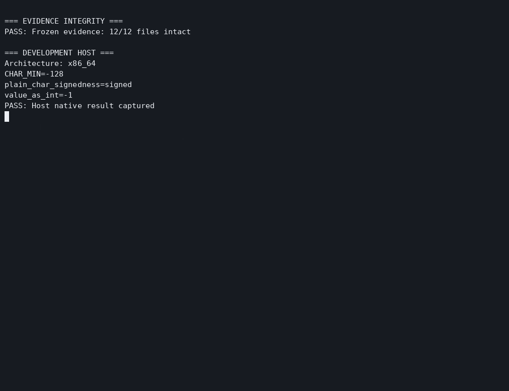
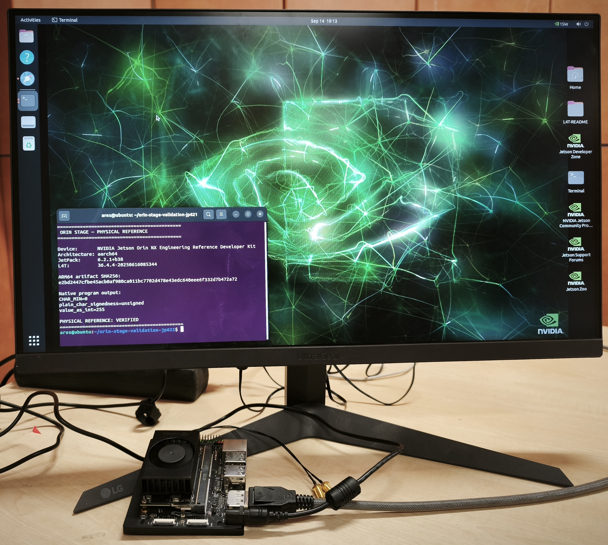

# JP6.2.1 Physical Validation — Jetson Orin NX 16 GB

This directory contains the physical validation record for:

| | |
|---|---|
| **Reference device** | NVIDIA Jetson Orin NX 16 GB |
| **JetPack** | 6.2.1 |
| **Jetson Linux / L4T** | 36.4.4 |
| **Architecture** | ARM64 / `aarch64` |
| **Orin Stage target** | `jetson-orin@jp6.2.1` |

The goal of this record is narrow: compare the JetPack userspace and CPU-side behavior that Orin Stage is designed to reproduce with a matching physical Jetson reference.

It is **not** a claim that QEMU reproduces Jetson GPU, DLA, camera, kernel, firmware, power, thermal, or performance behavior.

---

<p align="center">
  
</p>

---

## Result

**PHYSICAL VALIDATION: PASS**

The recorded validation established:

- exact `nvidia-jetpack` package identity on both sides: `6.2.1+b38`
- exact `nvidia-l4t-core` package identity on both sides: `36.4.4-20250616085344`
- identical `nvidia-l4t-core` package manifest
- **51 / 51** package-owned `nvidia-l4t-core` payload files matched byte-for-byte
- the exact same ARM64 demo binary was used in Orin Stage and on the physical Jetson
- Orin Stage and physical Jetson produced identical ARM64 demo output
- native x86_64 produced the expected different architecture-sensitive output
- the validation run left the Orin Stage workspace generation unchanged

---

## Physical reference



The photo is supporting context. The technical record is the reproducible output, hashes, manifests, script, and terminal capture stored in this directory.

---

## Headline artifact check

The ARM64 demo binary used on both Orin Stage and the physical Jetson:

```text
SHA256
e2bd2447cfbe45acb0af980ca011bc7702d478e43edc640eee6f332d7b472a72
```

Observed output on both ARM64 environments:

```text
CHAR_MIN=0
plain_char_signedness=unsigned
value_as_int=255
```

Native x86_64 control:

```text
CHAR_MIN=-128
plain_char_signedness=signed
value_as_int=-1
```

The demo shows an architecture/ABI-sensitive userspace difference. JetPack-specific parity is supported separately by the exact package identity and 51/51 package-owned payload comparison.

---

## ARM64 reference probe

The same deterministic probe output was recorded on Orin Stage and the physical Jetson.

Both output files have SHA-256:

```text
c30c35eaebb5dcfcb500742e371d3502fedf4c2bc3795eb74ac954b25ca3b3ba
```

The native x86_64 negative control intentionally differs because its Debian architecture is `amd64`.

---

## NVIDIA package/payload comparison

For `nvidia-l4t-core`:

```text
Version: 36.4.4-20250616085344
Architecture: arm64
Package-owned payload entries checked: 51
Result: 51 / 51 matched
```

The complete Orin Stage and physical payload evidence files are byte-for-byte identical.

Evidence SHA-256:

```text
a24bfedb7a1482f881e57bf9dc7d6dea89ab12817cbbc6f6b32059794ebbd999
```

This is intentionally a package-scoped claim. It does not mean every file in the complete physical Jetson filesystem is identical to the Orin Stage workspace.

---

## Replay the validation

The final terminal recording is stored as an asciicast:

```bash
asciinema play final-physical-validation.cast
```

Recording SHA-256:

```text
df20a68a8be1f0d03256f9ed5b2ace6e933962843729cf3c813e5ae2d211095b
```

The recording runs `live-demo.sh`, which checks the frozen evidence, queries Orin Stage, queries the physical Jetson, verifies the exact ARM64 artifact, compares outputs, and prints `PHYSICAL VALIDATION: PASS` only after the checks succeed.

---

## Verify the evidence

From this directory:

```bash
sha256sum -c raw-evidence.sha256
sha256sum -c final-evidence.sha256
```

Expected result:

```text
12 / 12 raw evidence files: OK
4 / 4 final evidence entries: OK
```

The SHA-256 of `final-evidence.sha256` itself is:

```text
150313ccb845f4485258f6ba963c9d419907d97e36b418cd73f9dc4b11242d83
```

---

## Files

| Path | Purpose |
|---|---|
| `physical-baseline.txt` | physical Jetson baseline identity |
| `orin-stage-reference.txt` | deterministic probe output from Orin Stage |
| `physical-reference.txt` | same probe on the physical Jetson |
| `x86-native-negative-control.txt` | native x86_64 negative control |
| `orin-stage-l4t-core-payloads.txt` | Orin Stage `nvidia-l4t-core` package/payload evidence |
| `physical-l4t-core-payloads.txt` | physical Jetson package/payload evidence |
| `x86-native-char-output.txt` | native x86_64 demo result |
| `orin-stage-char-output.txt` | Orin Stage ARM64 demo result |
| `physical-char-output.txt` | physical Jetson ARM64 demo result |
| `char-demo/char_signedness.c` | demo source |
| `char-demo/char-x86` | native x86_64 binary |
| `char-demo/char-arm64` | exact ARM64 artifact used for the comparison |
| `live-demo.sh` | live validation runner used for the final recording |
| `final-physical-validation.cast` | final terminal recording |
| `physical-orin-nx-jp621.jpeg` | physical reference photo |
| `raw-evidence.sha256` | hashes for the frozen raw evidence |
| `final-evidence.sha256` | hashes for the final presentation/evidence layer |

---

## Scope boundary

This validation supports the claims made by Orin Stage for the tested JetPack userspace and CPU-side behavior.

It does **not** validate:

- GPU or CUDA hardware execution
- DLA
- camera or sensor behavior
- Jetson kernel / device-node / ioctl behavior
- bootloader, firmware, or device tree
- performance, power, thermals, or timing

Those remain physical-hardware concerns.
